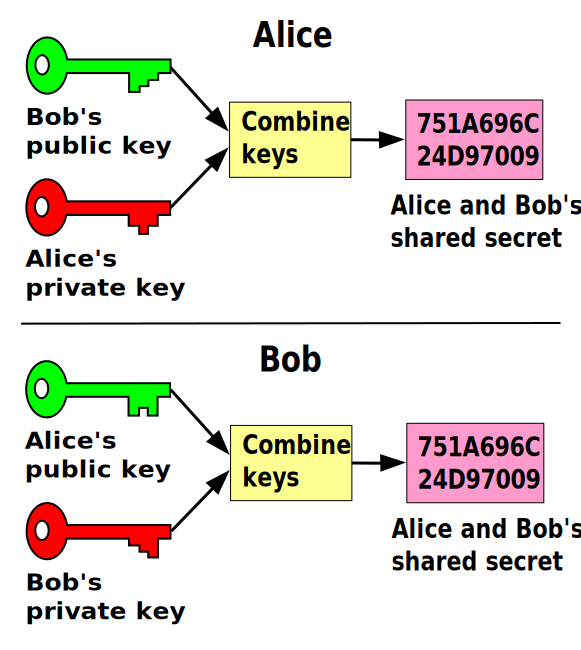

# Off The Record
## Securing instant messages

## **Alice** want to talk with **Bob**

## **Alice** want to talk with **Bob**
### They go and use a popular IM

# Done

## **Eve** thinks **Bob** is a terrorist

## **Eve** thinks **Bob** is a terrorist
### (And **Alice**, and **you** and **everybody**)

## **Alice** want to say she
## does not agree with **Eve** to **Bob**

## **Alice** want to say she
## does not agree with **Eve** to **Bob**
### **Eve** eavesdrop's the talk

### Everybody is **arrested and charged** as 'terrorists'

# :(

# Is it all **lost**?

# Let's go
# Off The Record

# **OTR** features
* Encryption
* Authentication
* Deniability
* Perfect forward secrecy

# Encryption
### No one else can read your instant messages.

# Authentication
### You are assured the correspondent is who you think it is.

# Deniability
### The messages you send do not have digital signatures that are checkable by a third party.

# Perfect forward secrecy
### If you lose control of your private keys, no previous conversation is compromised.

# Logging

# Logging
### Make sure it is disabled for important conversations

# How **OTR** Works
### Lets get techy

# How **OTR** Works
### Lets get techy, while keeping it simple

## Hybrid algorithm
* Asymmetric keys for authenticating and initiating a secure channel
* Symmetric keys for session communication, never shared over the channel

# Opportunistic encryption
### Tries to encrypt without being too noisy

# Fingerprint verification
### The socialist millionare problem

# IM Clients
* [Adium](https://www.adium.im/) (Mac OS)
* [Jitsi](https://jitsi.org/) (Win/Mac/Linux)
* [Pidgin](https://pidgin.im) with [OTR plugin](https://otr.cypherpunks.ca/) (Win/Linux)
* Chat Secure ([android](https://play.google.com/store/apps/details?id=info.guardianproject.otr.app.im)|[iphone](https://itunes.apple.com/us/app/chatsecure/id464200063?mt=8))

# SMS clients
* [TextSecure](https://play.google.com/store/apps/details?id=org.thoughtcrime.securesms&hl=en) (Android)
  * IOS In [development](https://github.com/WhisperSystems/TextSecure-iOS) ([soon in the store](http://arstechnica.com/security/2013/08/in-surveillance-era-clever-trick-enhances-secrecy-of-iphone-text-messages/))

# Links
* [Libotr official website](https://otr.cypherpunks.ca/)
* [Diffie-Helman key exchange](https://en.wikipedia.org/wiki/Diffie%E2%80%93Hellman_key_exchange)
* [Sociallist millionare problem](https://en.wikipedia.org/wiki/Socialist_millionaire)
* [List of OTR enabled clients and plugins](https://otr.cypherpunks.ca/software.php)
* [Protocol Spec](https://otr.cypherpunks.ca/Protocol-v3-4.0.0.html)
