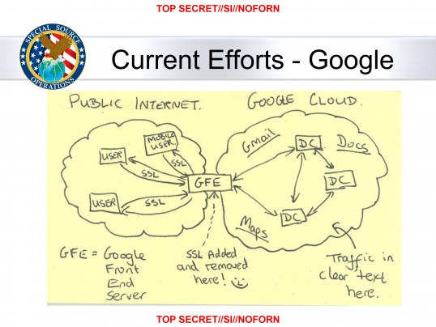
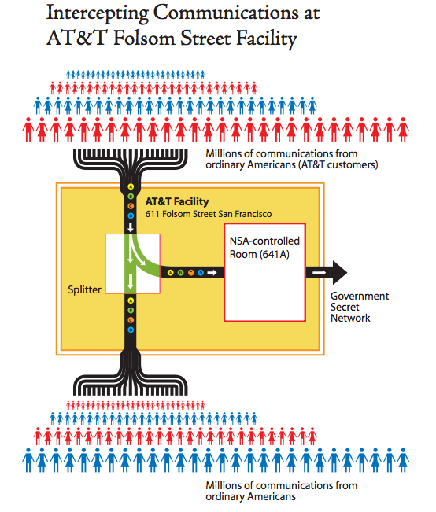
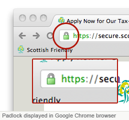

# Security and Privacy
## On the Internet

## I have some **questions** for you.

## What is going on in the **world**?
Note:
* Recent news
* Dilma's speech on ONU
* Manning and Snowden

## Do you **think** it affects you **personally**?

## Do you have anything to **hide**?

## Lets try to see
## the bigger picture
Note:
* Talk about the surveilance state on the US
* Telephone wiretiping -> digital wiretiping
* Explain SSL
  * The locker on the page
* Explain that US would like to you to be afraid of cryptography
* Hacking into the system to get the info
* Private intelligence companies contributing to private companies

## **Risk** analysis

## **Risk** analysis
* Resources

## **Risk** analysis
* Resources
* Motivation

## **Risk** analysis
* Resources
* Motivation
* Skill

## Let's **imagine**...
Note:
* Big control over the world

# **$52.6 billion**

# **$52.6 billion**
## **$**25.6 billion
#### data collection, processing and analysis

## More than **100.000** employees

## More than **100.000** employees
#### (Bonus if you speak another language)

## **Bend** laws

## **Bend** laws
* Illegal wiretapping

## **Bend** laws
* Illegal wiretapping
  * Law to allow retroactive warrant

## **Bend** laws
* Digital wiretapping

## **Bend** laws
* Digital wiretapping

## Cryptography **changed** their game

## **SSL**- Secure website

# Is it all **lost**?

# **Psychological** war

## How does this affect
# **you**?

Note:
* Privacy
  * Locking your house
  * Password for facebook
  * Sexyfaces.com

## How does this affect
# **society**?

## How does this affect **society**?
* Absolute surveillance
  * "You can only have what they allow you to have"
  * Undermine political views
  * Undermine innovation
  * Corporate espionage
   * Make and break economies
  * Totalitarianism

## Things you can do to start protecting **yourself**
  * Cryptography
    * Go for open source projects 
    * Easier to spot backdoors
  * Secure communication
    * Some information requires secure channels
    * End-to-End encryption

# Make **people** aware

## Links
  * [The black budget](http://www.washingtonpost.com/wp-srv/special/national/black-budget/)
  * [Cryptome](http://cryptome.org/)
    * [End hyprocrisy with leaks](http://cryptome.org/2013/10/end-hypocrisy-with-leaks.htm)
  * [NSA infiltrate internet link to Yahoo and Google](www.washingtonpost.com/world/national-security/nsa-infiltrates-links-to-yahoo-google-data-centers-worldwide-snowden-documents-say/2013/10/30/e51d661e-4166-11e3-8b74-d89d714ca4dd_story.html)
